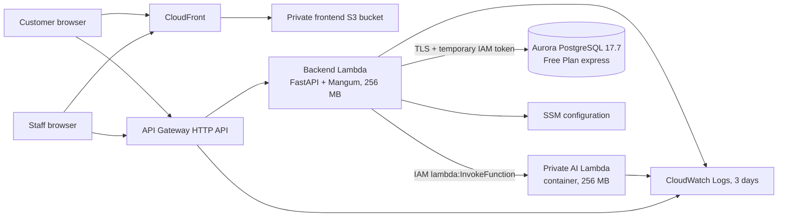

# Deployed System Architecture

## Actual AWS deployment

All regional resources are deployed in **Singapore (`ap-southeast-1`)**. CloudFront and AWS Budgets are global services.

## Networking and security

- Aurora uses express configuration with the AWS-managed internet access gateway, IAM authentication, 0–4 ACUs, 1 GiB storage, one writer, no reader, no VPC, and no Multi-AZ option.
- Lambda functions are not attached to a customer VPC. No NAT Gateway, interface endpoint, public EIP, EC2, ECS, Fargate, or load balancer exists.
- The backend invokes AI directly through IAM; AI has no public HTTP endpoint.
- Both S3 buckets block public access and use AES-256 encryption. CloudFront reads frontend objects through Origin Access Control.
- The JWT signing key is stored as an SSM `SecureString`. Other runtime values use standard SSM parameters.
- API Gateway throttles at 10 requests/second with burst 20. No provisioned or reserved Lambda concurrency is configured.
- The CloudFront root serves a lightweight portal chooser. Customer and staff applications remain separate static routes at `/customer/index.html` and `/staff/index.html`, each with a return link to `/`.

## Reliability behavior

AI failure does not discard a complaint. The deployed failure test disabled AI invocation, confirmed that the backend persisted the ticket as `pending_classification`, confirmed staff reclassification returned 503 without corrupting workflow state, and then confirmed AI recovery.
