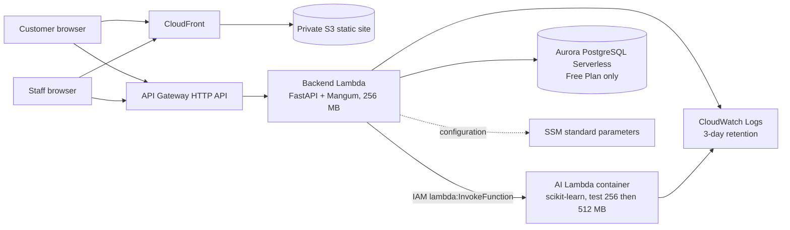

# AWS Zero-Cost Plan (Pre-deployment)

Status: **design and local feasibility only; no AWS resources have been created.** Prices and account eligibility must be rechecked in the AWS console immediately before deployment.

## Recommended architecture

Neither Lambda enters a customer VPC. The backend invokes AI through the regional Lambda API and connects over TLS with an ephemeral IAM token to the Aurora-managed internet access gateway supplied by Free Plan express configuration. The AI has no database permission or public endpoint. This removes NAT, paid endpoints, public IPv4 allocations, and all customer VPC resources.

## Expected usage and conditional cost

| Service | Expected assignment usage/month | Published allowance or protection to verify | Expected actual cost |
|---|---:|---|---|
| Backend Lambda | <5,000 requests; about 1,250 GB-s at 256 MB/1 s | Lambda allowance: 1M requests and 400,000 GB-s/month | **Expected $0 if allowance applies and is not shared/exhausted** |
| AI Lambda | <1,000 requests; about 1,000 GB-s at 512 MB/2 s | Same account-level Lambda allowance | **Expected $0 if allowance applies** |
| API Gateway HTTP API | <5,000 calls | 1M HTTP API calls/month for up to 12 months; Free Plan credits may cover later usage | **Expected $0 only while eligible/within credit** |
| S3 | <20 MB static assets and artifacts | Check the account's current S3 Free Tier/Free Plan offer | **Expected $0 if eligible and request/storage limits are not exceeded** |
| CloudFront | <1 GB and <10,000 requests | Prefer the $0 flat-rate Free plan on an eligible Paid Plan account; otherwise verify standard allowance | **Expected $0 only after plan eligibility is confirmed** |
| PostgreSQL | <1 GB, one small cluster | Aurora PostgreSQL Free Plan express configuration: account must be eligible; published limits include 4 ACUs/cluster and 1 GB/cluster | **Expected $0 only on a qualifying Free Plan account while its plan/credits remain active** |
| CloudWatch Logs | <100 MB, 3-day retention | Verify current account allowance; ingestion and retained storage become metered outside it | **Expected $0 if within allowance** |
| SSM Parameter Store | 2–5 standard parameters | Standard parameters have no additional charge | **Expected $0; avoid advanced parameters and higher-throughput mode** |
| ECR (AI image) | One small image, old images deleted | Storage is metered; account allowance/credits must be checked | **Depends; expected credit-covered only, not inherently free** |

The database is the gating item. AWS Free Plan accounts are protected from charges until they upgrade, but the plan ends after six months or when credits are exhausted. A Paid Plan account can incur usage charges. Therefore this document does not promise `$0` until the console confirms the exact account and database offer.

## Database choice

1. **Only when eligible in Singapore:** one Aurora PostgreSQL Serverless Free Plan cluster created through the documented express configuration, its AWS-selected covered instance topology, 1 GB maximum assignment data, no manually added replicas, no Global Database, no zero-ETL, and the smallest permitted capacity range. Console eligibility must still be checked before deployment.
2. **Alternative:** conventional RDS PostgreSQL `db.t4g.micro`, Single-AZ and minimum eligible storage, only if the Billing/Free Tier console explicitly shows this exact combination is covered for this account. A provisioned RDS instance can charge while idle when coverage ends.
3. **Stop condition:** if neither database is explicitly covered, do not create paid PostgreSQL. DynamoDB has an attractive low-volume allowance but requires a substantial data-access redesign and is not approved in this phase.

## Accidental-charge analysis

| Resource | Can it charge at zero traffic? | Typical accidental charge | Avoid / monitor |
|---|---|---|---|
| Lambda | Normally no; storage can | Excess requests/duration, provisioned concurrency, excess code/image storage | No provisioned concurrency; low memory; monitor requests, GB-s, storage |
| API Gateway HTTP API | No request charge at zero calls | Crawlers, public abuse, looping test clients | HTTP API only; restrictive CORS; monitor calls |
| S3 | **Yes** | Stored objects/versions, requests, transfer | No versioning; tiny bucket; delete artifacts; monitor bytes/requests |
| CloudFront | Depends on selected plan | Exceeding standard allowance or selecting an ineligible plan | Confirm plan; generated domain; no paid WAF |
| Aurora/RDS | **Yes/depends** | Plan/credit expiry, ACU/instance hours, storage/backups/snapshots | Confirm eligibility/end date; add no instances; delete after marking |
| ECR | **Yes** | Image storage | One repository/image; lifecycle cleanup; delete after demo |
| CloudWatch | **Yes** | Log ingestion/retention, custom metrics/dashboards | 3-day retention; no paid dashboards/custom metrics |
| Parameter Store | No for standard tier | Advanced parameters or higher throughput | Explicit Standard tier; monitor settings |
| Networking | No customer network resources planned | Accidentally selecting full Aurora configuration or adding NAT/endpoints/public IPv4 | Express configuration only; audit that no VPC resources were created |

## Mandatory account checklist before any resource

- Billing and Cost Management → **Free Tier**: record whether the account is Free Plan or Paid Plan and its displayed end date.
- Account page: record account creation date and whether 12-month offers are active.
- Credits page: record remaining credits, expiry dates, and eligible services.
- Bills/Cost Explorer: confirm current-month charges and identify resources sharing allowances.
- Free Tier usage: inspect Lambda, API Gateway, S3, CloudFront, CloudWatch, ECR, and database use.
- Billing preferences: enable Free Tier usage and billing alerts; verify the billing email.
- Budgets: one monthly budget with alerts at **$1, $3, and $5**. An alert warns; it does not stop resources.
- Confirm `ap-southeast-1` is selected and the required services are available.
- CloudFront: confirm $0 flat-rate Free plan eligibility. AWS says Free Plan accounts cannot use flat-rate plans; otherwise verify standard allowance.
- Database screen: capture explicit coverage for engine, size/capacity, storage, Region, and estimated charge. If absent, stop.
- Confirm no organization/linked-account activity is consuming shared allowances.

## Region decision

Use **Singapore (`ap-southeast-1`) only** for all regional resources. CloudFront is global. If the covered Aurora express option is absent in Singapore, stop instead of changing Regions; account eligibility controls the zero-cost conclusion.

## Explicit exclusions

No ECS/Fargate, ALB/NLB, NAT Gateway, EC2, SageMaker, Bedrock, EKS, paid WAF, Route 53/custom domain, provisioned concurrency, RDS Proxy, Multi-AZ, paid interface endpoint, or public AI endpoint.
